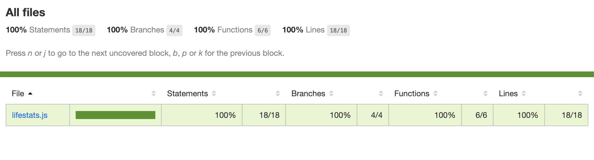

# _Independent Project #5: Super Galactic Age Calculator_

#### Contributors: _**Claire Thorington**_

#### _A page demonstrating new skills in TDD with JavaScript!_

## Technologies Used

* HTML
* CSS
* Markdown
* JavaScript
* jQuery

## Description

This application takes a person's inputted age and life expectancy in Earth years and create a class that does the following:

* Returns their age in Mercury years
* Returns their age in Venus years
* Returns their age in Mars years
* Returns their age in Jupiter years
* Determines how many years a user has left to live on each planet
* If a user has already surpassed the average life expectancy, it returns the number of years they have lived past their life expectancy

## Setup/Installation Requirements

* Clone this repository to your desktop
* Navigate to the top level of the directory
* To view business logic, navigate to the __src__ folder and open the lifestats.js file
* To view tests for business logic, navigate to the __tests__ folder and open the lifestats.test.js file

## Known Bugs

* None! Business logic has 100% line coverage with Jest.

## License

_MIT_

Copyright (c) _2022_ _Claire Thorington_